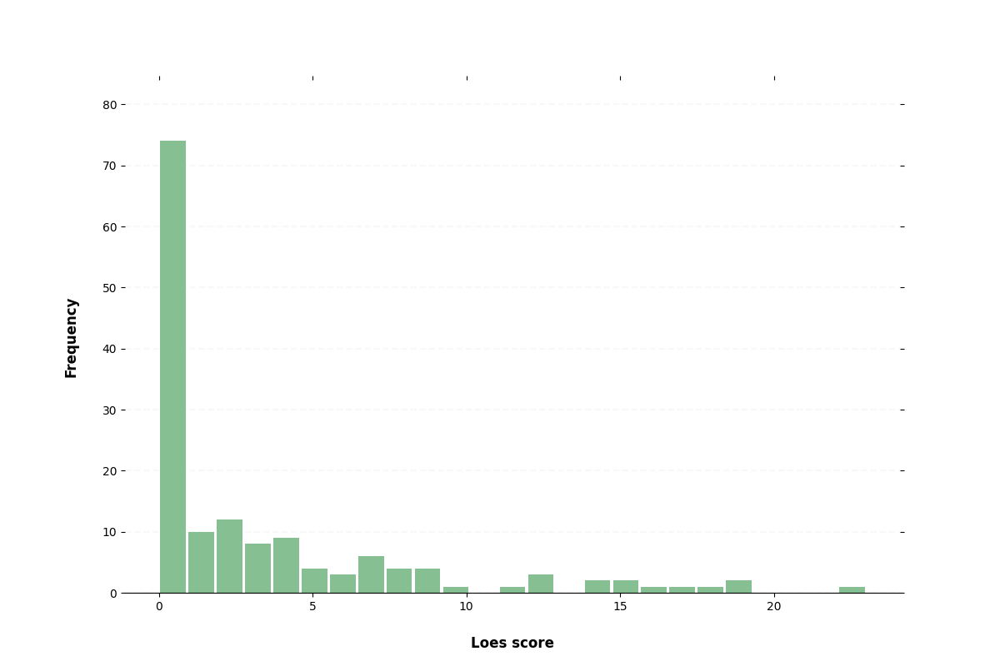

# Information on Loes scoring data

## Score information

## File information

* Subject/session count: 292
* mprage file count: 291
* swi file count: 238
* flair file count: 117
* mprage image sizes: ['[176, 256, 256]' '[160, 256, 256]' '[192, 240, 256]'
 '[144, 512, 512]' '[512, 512, 58]' '[176, 512, 512]' '[192, 256, 256]'
 '[141, 256, 256]' '[208, 256, 256]' '[176, 240, 256]' '[160, 512, 512]'
 '[256, 208, 256]' '[512, 512, 35]' '[256, 183, 256]' '[88, 156, 160]'
 '[256, 256, 54]' '[256, 256, 181]' '[256, 197, 256]']
* swi image sizes: ['[208, 256, 96]' '[232, 256, 56]' '[208, 256, 104]' '[208, 256, 56]'
 '[208, 256, 52]' '[216, 256, 60]' '[192, 256, 72]' '[208, 256, 80]'
 '[232, 256, 70]' '[232, 256, 96]' '[216, 256, 104]' '[232, 256, 104]'
 '[208, 256, 88]' '[256, 256, 104]' '[216, 256, 96]' '[208, 256, 1]'
 '[192, 256, 80]' '[208, 256, 72]' '[240, 320, 40]' '[192, 256, 88]'
 '[256, 256, 96]' '[208, 256, 48]' '[232, 256, 48]' '[232, 256, 112]'
 '[232, 256, 80]' '[192, 256, 96]' '[240, 256, 96]' '[224, 256, 96]'
 '[216, 256, 56]' '[224, 256, 52]' '[208, 256, 112]']
* flair image sizes: ['[260, 320, 27]' '[240, 320, 30]' '[260, 320, 31]' '[260, 320, 30]'
 '[160, 256, 256]' '[320, 320, 31]' '[320, 320, 25]' '[320, 320, 10]'
 '[260, 320, 33]' '[270, 320, 33]' '[260, 320, 28]' '[320, 320, 27]'
 '[260, 320, 29]' '[280, 320, 30]' '[320, 320, 30]' '[260, 320, 32]'
 '[270, 320, 32]' '[290, 320, 30]' '[280, 320, 32]' '[270, 320, 31]'
 '[320, 320, 32]' '[320, 320, 33]' '[320, 320, 16]' '[290, 320, 31]'
 '[320, 320, 29]' '[270, 320, 29]']

The code for generating this image is largely [here]([src/util/image_analysis.py](https://github.com/DCAN-Labs/AlexNet_Abrol2021/blob/master/src/util/image_analysis.py)).
