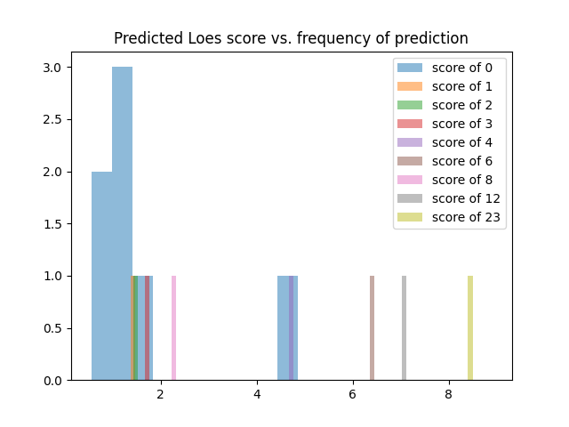
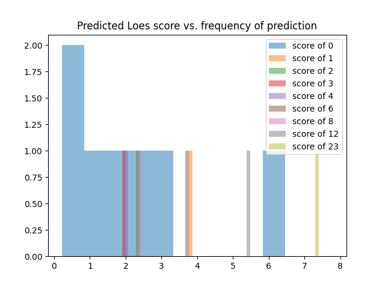
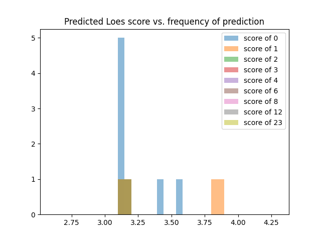

# Training runs

All scores are for the validation set.

## Run 1
* standardized_rmse: 1.1676927301825617
* Mean square error: 19.85
* Epochs: 1024

## Run 0

* Mean square error: 21.93
* Epochs: 512

## Run 2

* standardized_rmse: 2.0713074787105747
* Mean square error: 22.41
* Epochs: 512
* Weighted loss of non-0 cases by twice as much

## Run 3

* standardized_rmse: 2.491876086736497
* Mean square error: 27.1381
* Epochs: 1024
* Image augmentation: 
    * [`tio.RandomElasticDeformation(num_control_points=7, locked_borders=2)`](https://torchio.readthedocs.io/transforms/augmentation.html#randomelasticdeformation)

## Run 4

* standardized_rmse: 28.959144972854443
* Mean square error: 39.9433
* Epochs: 512
* Image augmentation: 
    *     tio.RandomFlip(axes='LR'),
                tio.OneOf({
                    tio.RandomAffine(): 0.8,
                    tio.RandomElasticDeformation(): 0.2,
                })

