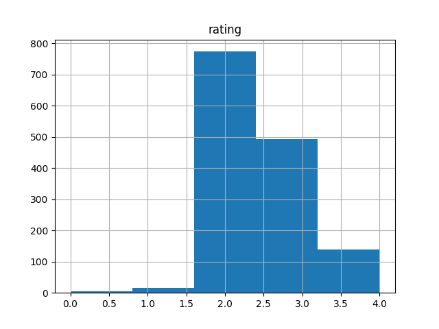
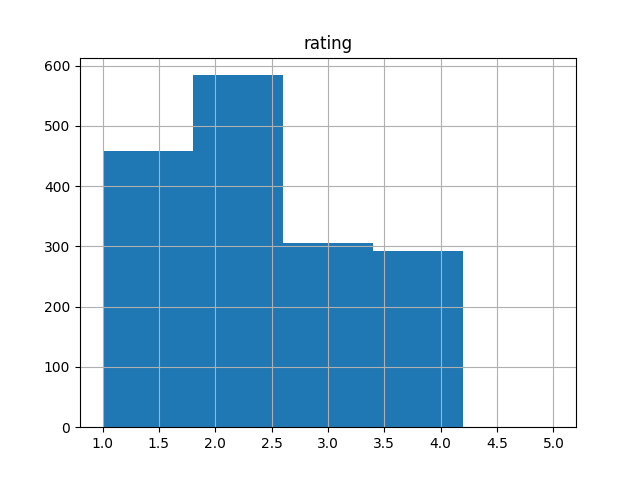
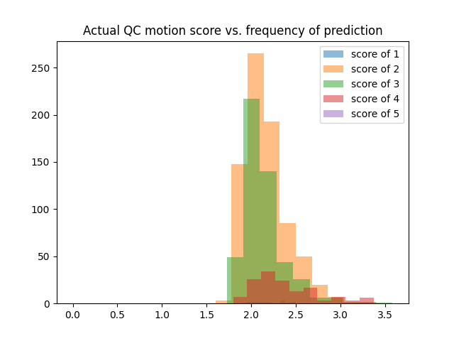
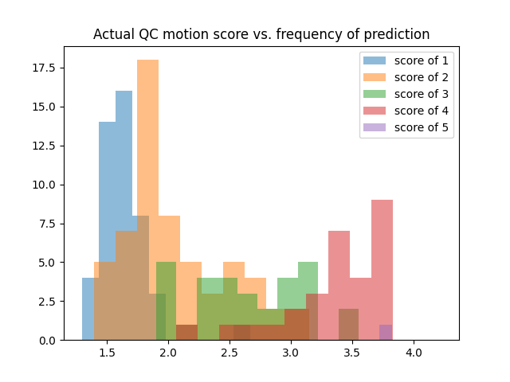

Motion QC Score
===================

BCP distribution
----------------

The values range from 0.0 to 4.0.

eLabe distribution
----------------

The values range from 1.0 to 5.0.

---

Model 3
-------

* Standardized RMSE (on validation set): **0.3486471956656407**
* Mean squared error (on validation set): 0.1235
* Model architecture: AlexNet3D_Dropout_Regression
* Optimizer: Adam
* Epochs: 1000
* Location: */home/feczk001/shared/data/AlexNet/MotionQC/model03.pt*

Model 8
-------

* Mean squared error (on eLabe): **0.2150**
* Model architecture: AdamNet
* Optimizer: Adam
* Epochs: 128
* Location: */home/feczk001/shared/data/AlexNet/MotionQC/model08.pt*
* Training data: BCP
* Test data: eLabe

Model 9
-------

* Mean squared error (on BCP): **0.4636**
* Model architecture: AdamNet
* Optimizer: Adam
* Epochs: 128
* Location: */home/feczk001/shared/data/AlexNet/MotionQC/model09.pt*
* Training data: eLabe
* Test data: BCP

Model 2
-------

* Mean squared error (on validation set): **0.4121**
* Model architecture: AlexNet3D_Dropout_Regression
* Optimizer: Adam
* Epochs: 100

Model 1
-------

* Mean squared error (on validation set): **0.4855**
* Model architecture: AlexNet3D_Dropout_Regression
* Optimizer: Adam
* Epochs: 55

Model 4
--------

* Standardized RMSE (on validation set): **0.8296178502909233**
* Model architecture: AdamNet
* Optimizer: Adam
* Epochs: 256
* Data source: */panfs/jay/groups/6/faird/shared/projects/motion-QC-generalization/code/bcp_and_elabe_qc_train_space-infant_unique.csv*
* Model location: */home/feczk001/shared/data/AlexNet/motion-qc-model04.pt*
* Training data: eLabe and BCP
* Test data: eLabe and BCP

Model 7
-------

* Standardized RMSE (on validation set): **1.08185627460534**
* Mean squared error (on validation set): 0.4542
* Mean squared error (on training set):   0.4139
* Model architecture: AlexNet3D_Dropout_Regression
* Optimizer: Adam
* Epochs: 128
* Dataset(s): BCP and eLabe
* Location: */home/feczk001/shared/data/AlexNet/MotionQC/model07.pt*

Model 6
-------

* Standardized RMSE (on validation set): **1.3027799144029593**
* Mean squared error (on validation set): 0.4758
* Model architecture: AlexNet3D_Dropout_Regression
* Optimizer: Adam
* Epochs: 64
* Dataset(s): BCP and eLabe
* Location: */home/feczk001/shared/data/AlexNet/MotionQC/model06.pt*

Model 10
--------

* Standardized RMSE (on validation set): **2.171439941339671**
* Mean squared error (on validation set): n.nnnn
* Model architecture: AlexNet3D_Dropout_Regression
* Optimizer: `Adam(self.model.parameters(), lr=0.0001, amsgrad=True)`
* Epochs: 256
* Dataset: eLabe: */panfs/jay/groups/6/faird/shared/projects/motion-QC-generalization/code/elabe_qc_train_space-infant_unique.csv*
* Location: */home/feczk001/shared/data/AlexNet/motion_qc_elabe_00.pt*

Model 5
-------

* Standardized RMSE (on validation set): **[undefined---sigma was zero]**
* Mean squared error (on validation set): 0.3301
* Model architecture: AlexNet3D_Dropout_Regression
* Optimizer: SGD
* Epochs: 1000
* Location: */home/feczk001/shared/data/AlexNet/model05.pt*
