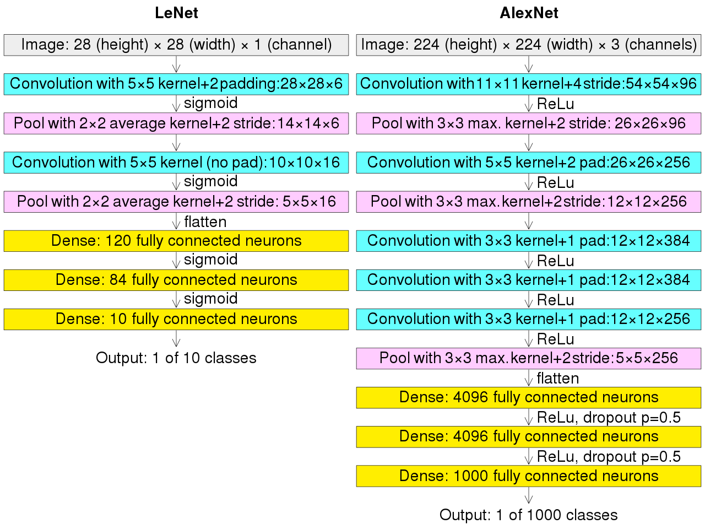

# Loes Scoring using Deep Learning

* The Loes score is an adrenoleukodystrophy (ALD) MRI score, which rates the severity of white matter lesions and ranges from 0 (normal) – 34 (abnormal)

---

# Clinician computation
* 34 parts of the brain are examined
* Each part is given a score of either 0 (no white matter lesions) or 1 (white matter lesions present)
* Individual scores are summed

---

# Scoring using a deep learning model
* Abrol, A., Fu, Z., Salman, M. et al. [Deep learning encodes robust discriminative neuroimaging representations to outperform standard machine learning](https://doi.org/10.1038/s41467-020-20655-6). *Nat Commun 12*, 353 (2021)
* [aabrol/SMLvsDL](https://github.com/aabrol/SMLvsDL/tree/master/reprex): Implementation of AlexNet in Python using the PyTorch library

---

# AlexNet
* Convolutional neural network architecture that won the 2012 ImageNet ILSVRC challenge
* Developed by Alex Krizhevsky, Ilya Sutskever, and Geoffrey Hinton
* First architecture to stack convolutional layers directly on top of one another, instead of stacking a pooling layer on top of each convolutional layer

---

# AlexNet (continued)

* Our implementation is 3-D, rather than 2-D
* We use regression in the last layer to output real number between 0 and 34

---

# Two approaches
* Top-down: one model taking whole-brain MRI as input and giving output number between 0 and 34
* Bottom-up: 34 models (possibly only 17 up to symmetry) each taking segment of brain as input and 0 or 1 as output
* We're hoping the top-down works, if only for simplicity.  There are arguments for and against the bottom-up approach

---

# References

* [Overall intact cognitive function in male X-linked adrenoleukodystrophy adults with normal MRI](https://ojrd.biomedcentral.com/articles/10.1186/s13023-019-1184-4), by Noortje J. M. L. Buermans, Sharon J. G. van den Bosch, Irene C. Huffnagel, Marjan E. Steenweg, Marc Engelen, Kim J. Oostrom & Gert J. Geurtsen
* By Cmglee - Own work, CC BY-SA 4.0, https://commons.wikimedia.org/w/index.php?curid=104937230

---

# Questions and comments

* This document is stored in [DCAN-Labs/AlexNet_Abrol2021](https://github.com/DCAN-Labs/AlexNet_Abrol2021).
